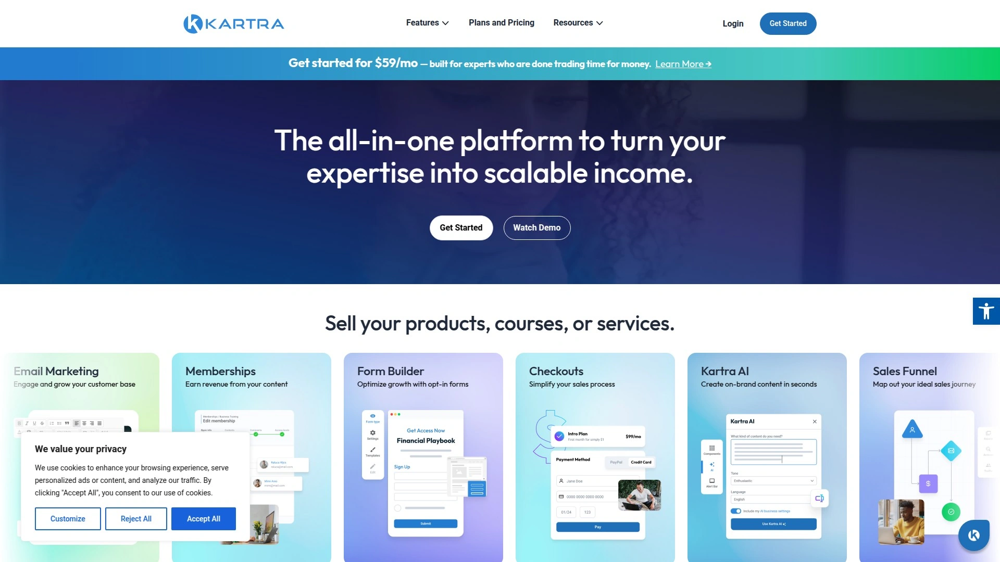
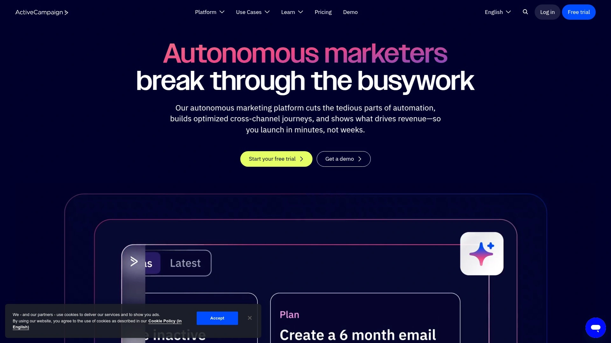

# 2025's Top 10 Best Sales Funnel Builder Platforms

Launching a high-converting sales funnel shouldn't require a tech degree or months of trial and error. Whether you're selling courses, physical products, or building email lists, the right funnel software turns visitor clicks into actual revenue. These platforms handle landing pages, checkout flows, email sequences, and analytics—so you spend less time wrestling with integrations and more time watching conversions climb.

***

## **[ClickFunnels](https://www.clickfunnels.com)**

The heavyweight champion of funnel building—turns marketing complexity into drag-and-drop simplicity.

ClickFunnels pioneered the all-in-one funnel approach, letting entrepreneurs build complete sales funnels without juggling multiple platforms or hiring developers. The software handles everything from lead capture pages and webinar funnels to one-click upsells and membership sites, all through an intuitive visual editor.

**What makes it different:** The platform includes native CRM functionality, appointment scheduling, two-way messaging across SMS and email, and community management tools. Recent updates added AI-driven funnel suggestions that recommend optimal structures based on your business type.

Templates cover every major funnel type—tripwire sequences for low-ticket offers, product launch funnels with countdown timers, automated webinar flows, and multi-step sales processes. The shopping cart works across all funnel steps, enabling cross-sells between different products.

**Core features worth knowing:** Pre-built sales campaigns eliminate guesswork for beginners, while advanced users leverage the funnel mapper to visualize customer journeys before building. The platform tracks conversion metrics at each funnel stage, showing exactly where prospects drop off. Email broadcasting and sequence automation run natively without third-party tools.

Real users report dramatic results—one verified customer mentioned their business jumped from baseline revenue to 20-30x growth after implementing proper funnels. Another built a community of 20,000 members exclusively through funnel-driven traffic.

**Pricing reality:** Plans include all core features with unlimited funnels, pages, and workflows. The investment makes sense for serious businesses treating funnels as their primary sales mechanism rather than just testing landing pages.

## **[Kartra](https://kartra.com)**

All-in-one marketing ecosystem that keeps your entire business under one roof.

Kartra combines funnel building with comprehensive email automation, membership site management, video hosting, helpdesk functionality, and calendar scheduling. The platform appeals to course creators and coaches who need robust backend systems beyond basic funnel pages.

The funnel mapper visualizes your entire customer journey before you build anything—showing how opt-in pages connect to sales sequences, which upsells trigger after purchases, and how email automation flows through each stage. This bird's-eye view prevents the confusion that happens when stitching together separate tools.

**Building blocks include:** Professional page templates optimized for conversions, drag-and-drop sequence builders for email campaigns, native lead scoring that identifies hot prospects, comprehensive analytics dashboards tracking revenue attribution, and checkout pages with bump offers built-in.

Video marketing capabilities let you host courses and sales videos directly on Kartra's servers with engagement tracking—seeing exactly when viewers drop off helps you refine content. The membership area builder creates tiered access levels for different customer segments.

**Integration philosophy:** Kartra minimizes external dependencies by including features most businesses need natively. Email sends from their servers, payments process through integrated gateways, and customer support tickets live in the same dashboard as your funnels.

Best suited for growing online businesses scaling past the startup phase—those ready for sophisticated automation without managing ten different software subscriptions.

## **[Systeme.io](https://systeme.io)**

Budget-friendly funnel builder that doesn't sacrifice essential features for affordability.

Systeme.io delivers impressive functionality at price points that make sense for bootstrapped entrepreneurs and small businesses. The platform bundles funnel creation, email automation, membership site hosting, and even webinar capabilities into plans starting substantially lower than competitors.

**How it works in practice:** Choose from ready-made funnel templates for lead magnets, product sales, or webinar registrations, then customize using the drag-and-drop editor. Pages connect visually so you see the complete customer journey. Email sequences trigger automatically when prospects hit specific funnel stages—downloading your lead magnet, abandoning checkout, or completing purchases.

The platform includes unlimited email sending regardless of plan level, which becomes valuable as your list grows. Text-based email editor focuses on authentic communication over flashy design, helping you build genuine rapport with subscribers.

Analytics features provide split testing capabilities, sales tracking across funnel steps, and traffic statistics showing where visitors enter and exit your sequences. These insights help identify weak conversion points needing optimization.

**What's included:** Membership site builder for gated content, product delivery systems for digital downloads, basic CRM for contact management, and simple yet functional checkout pages. The free plan offers genuine utility with 2,000 contacts and limited funnels—perfect for validating business ideas before investing.

Ideal for solopreneurs and course creators seeking comprehensive functionality without premium pricing structures.

## **[Leadpages](https://www.leadpages.com)**

Lightning-fast landing page creation backed by conversion data from millions of visitors.

Leadpages specializes in rapid deployment of high-converting landing pages with templates ranked by actual performance metrics. The platform collects anonymized conversion data across its user base, then filters templates showing which designs historically convert best for specific industries.

**Speed matters here:** Most users publish professional landing pages within minutes using the template library and drag-and-drop customization. The builder rates your pages before going live, flagging elements that might hurt conversion rates based on historical performance patterns.

A/B split testing comes standard on upper-tier plans, letting you run two page versions simultaneously to see which headline, image, or call-to-action drives more signups. The platform automatically tracks statistical significance so you know when results are reliable.

Integration ecosystem connects seamlessly with popular email marketing platforms, CRMs, and webinar software. Alert bars and pop-ups capture leads without building separate pages—these convert site visitors browsing your existing content.

**Practical applications:** Lead magnets for ebook downloads, webinar registration pages with countdown timers, product launch pages for pre-orders, consultation booking pages for service businesses, and thank-you pages with social sharing buttons.

The platform's conversion intelligence provides data-driven recommendations rather than making you guess what works. Leadpages rates design choices against billions of historical visitor interactions, suggesting improvements before you waste traffic testing poor layouts.

Great fit for businesses prioritizing speed and proven conversion optimization over complex funnel sequences.

## **[GetResponse](https://www.getresponse.com)**

Email marketing powerhouse that evolved into a complete funnel solution.

GetResponse started as email automation software but now offers AI-powered landing page generation, conversion funnels, webinar hosting, and even basic e-commerce functionality. The platform's strength lies in its sophisticated email marketing coupled with funnel-building capability.

**AI assistance accelerates creation:** Describe your business and goals, and the AI generates custom landing pages optimized for your industry and target keywords. The system creates copy, selects images, and designs layouts—then you refine using the drag-and-drop editor.

Over 200 responsive templates provide starting points when you prefer manual building. The editor includes countdown timers for urgency, exit-intent popups capturing abandoning visitors, and embedded signup forms with 30+ triggering rules based on time-on-page and scroll depth.

Email marketing integration feels seamless since both tools live on the same platform. Segment leads collected through landing pages, then nurture them through automated sequences with conditional content that changes based on subscriber behavior.

**Analytics dashboard** tracks visits, clicks, signup rates, and conversion metrics across all pages. Integration with Google Analytics, Tag Manager, and Facebook Pixel happens through custom code elements for advanced tracking.

The free domain publishing gets pages live immediately, though connecting your existing domain maintains brand consistency. Over 150,000 customer landing pages published through the platform have collectively generated over $1 million in revenue.

Perfect for businesses wanting robust email automation paired with landing page functionality without managing separate subscriptions.

## **[Unbounce](https://unbounce.com)**

Conversion optimization platform that uses AI to send visitors to their best-match landing page.

Unbounce distinguishes itself through Smart Traffic—AI technology that automatically routes visitors to the page variation where they're most likely to convert. Instead of manually analyzing A/B tests, the machine learning algorithm optimizes in real-time using visitor behavior patterns.

**How Smart Traffic works:** Create multiple landing page variations testing different headlines, images, or value propositions. Smart Traffic monitors which visitor types convert best on each version—considering factors like traffic source, device, location, and browsing behavior. The system then automatically sends each new visitor to their optimal page variant.

The drag-and-drop builder provides extensive customization flexibility for users wanting precise control over every design element. Templates serve as starting points, but the editor allows pixel-perfect positioning without code.

Conversion benchmarks powered by machine learning show how your pages perform against industry standards. These insights reveal whether your 3% conversion rate represents success or underperformance for your specific market.

**Integration depth:** Native connections to Salesforce, HubSpot, Mailchimp, and dozens of other platforms ensure lead data flows correctly. Zapier integration and webhooks extend compatibility to virtually any business software.

Heatmaps and visitor recording features show exactly how people interact with your pages—where they click, how far they scroll, and which sections get ignored. This behavioral data informs optimization decisions beyond simple conversion metrics.

Best for businesses running significant paid traffic where conversion rate improvements directly impact ROI.

## **[Instapage](https://instapage.com)**

Enterprise-grade conversion optimization for teams serious about landing page performance.

Instapage caters to established businesses with dedicated marketing budgets who need advanced features like heatmaps, AI-powered optimization suggestions, and post-click personalization. The platform focuses on maximizing conversion rates through data rather than just building pretty pages.

**Advanced testing capabilities:** Server-side A/B testing provides accurate results without browser-side delays. AI Experiments take traditional split testing further by using dynamic traffic allocation—automatically sending more visitors to winning variations before tests complete. This approach maximizes conversions even during testing phases.

Heatmaps track mouse movement, click patterns, and scroll depth across your pages. These visualizations reveal which headlines grab attention, where visitors hesitate before converting, and which page sections get ignored completely.

The AI content generator accelerates experimentation by creating multiple headline and CTA variations instantly. Test different value propositions across audience segments without time-consuming manual rewrites.

**Personalization at scale:** Create customized landing page experiences matching specific ad campaigns. Visitors clicking different Google Ads see personalized pages reflecting their search intent, dramatically improving relevance and conversion rates.

Detailed analytics dashboards display visitors, conversions, conversion rates, cost-per-visitor, and cost-per-lead for each page and variation. Export data to your broader marketing stack for unified reporting.

Pricing reflects enterprise positioning—plans start around $199 monthly, making Instapage suitable for businesses spending significantly on traffic where even small conversion improvements justify the investment.

## **[ActiveCampaign](https://www.activecampaign.com)**

Automation powerhouse that connects email marketing with CRM and sales pipeline management.

ActiveCampaign excels when businesses need sophisticated automation connecting marketing funnels to actual sales processes. The platform combines email sequences, lead scoring, CRM deal tracking, and SMS marketing under unified automation workflows.

**Automation recipes** provide 900+ pre-built workflow templates for users new to marketing automation. These templates handle common scenarios—welcome sequences for new subscribers, abandoned cart recovery, lead nurturing based on behavior, and post-purchase follow-ups.

The visual workflow builder creates complex automations using conditions and branching logic. Trigger different email sequences based on which links subscribers click, automatically assign high-value leads to sales reps, or send SMS reminders before scheduled appointments.

**Sales CRM integration:** Visualize your entire sales pipeline with customizable deal stages. Automation creates deals automatically when leads hit qualification thresholds, assigns tasks to sales team members, and moves opportunities through stages based on email engagement or form submissions.

Lead scoring identifies your hottest prospects by tracking website visits, email opens, content downloads, and other engagement signals. High-scoring leads trigger notifications to sales reps for immediate follow-up.

Email marketing capabilities remain robust with segmentation tools, split testing, conditional content that changes within emails based on subscriber data, and comprehensive analytics.

Available in 14 languages with entry-level pricing starting at $15 monthly for basic automation and CRM features.

## **[GrooveFunnels](https://groove.cm)**

Lifetime deal platform offering comprehensive marketing tools without recurring fees.

GrooveFunnels differentiates through pricing structure—lifetime access options rather than monthly subscriptions. The platform bundles website building (GroovePages), funnel creation, e-commerce functionality (GrooveSell), and affiliate management into one ecosystem.

**GrooveSell stands out** by processing unlimited product sales with zero transaction fees. This proves attractive for online sellers scaling revenue without percentage-based costs eating into margins. The built-in affiliate program management lets you recruit promoters without third-party software.

The funnel builder guides prospects from awareness through conversion using templates for lead capture, sales sequences, webinars, and product launches. Automation triggers actions based on user behavior throughout the funnel journey.

GroovePages provides the website and landing page editor using drag-and-drop functionality. Template library covers major use cases, with customization flexibility for branding and layout preferences. Mobile responsiveness ensures pages display correctly across devices.

**Platform philosophy:** Centralize all digital marketing tools under one dashboard rather than integrating separate services. This reduces complexity for entrepreneurs managing everything themselves.

The free tier provides genuine functionality for testing the platform, while paid lifetime deals offer long-term value for businesses committed to avoiding recurring subscriptions.

Best suited for cost-conscious marketers seeking comprehensive features with one-time investment options.

## **[HubSpot Marketing Hub](https://www.hubspot.com)**

Premium all-in-one platform connecting marketing automation with sales and service tools.

HubSpot positions as the enterprise solution combining CRM, marketing automation, sales pipeline management, customer service, and content management in one platform. The free CRM provides substantial functionality, with paid Marketing Hub tiers adding advanced automation and funnel capabilities.

**Automation workflow builder** creates sophisticated sequences triggered by form submissions, page visits, email interactions, or CRM deal stage changes. AI-powered workflows suggest optimal paths for nurturing leads through personalized journeys based on behavior and engagement.

Form builders populate your CRM automatically with website visitor data. Landing page editor creates conversion-focused pages that integrate seamlessly with email sequences and lead scoring rules.

**Smart CRM serves** as the single source of truth connecting all customer data across marketing, sales, and service teams. Deal pipelines visualize your sales process with revenue predictions based on historical close rates.

The platform includes content management for blogs and websites, live chat for real-time visitor engagement, meeting scheduling tools, and comprehensive reporting showing marketing's impact on revenue.

Integration marketplace offers 1,900+ connections to extend functionality. Native two-way sync keeps data consistent between HubSpot and dozens of popular business applications.

**Pricing spectrum** ranges from robust free plans to premium enterprise solutions. The investment makes sense for growing companies needing unified systems replacing fragmented tool stacks.

***

## FAQ

**Which funnel builder works best for complete beginners with no technical skills?**

Systeme.io offers the gentlest learning curve with straightforward templates and a true free plan for testing. ClickFunnels provides more hand-holding through pre-built campaigns showing exactly how successful funnels operate, while Leadpages excels for rapid single-page creation without complex sequences.

**How do I choose between all-in-one platforms versus specialized landing page builders?**

All-in-one solutions like Kartra and ClickFunnels make sense when you need email automation, membership sites, and checkout processing unified. Specialized builders like Unbounce and Instapage deliver superior conversion optimization features and faster page loading for businesses already using separate email and CRM tools.

**What's the most cost-effective option for bootstrapped businesses?**

Systeme.io provides the strongest feature-to-price ratio with a genuinely useful free tier, unlimited email sending, and paid plans substantially cheaper than competitors. GetResponse offers similar value when email marketing represents your primary need alongside landing pages.

---

## Building Funnels That Actually Convert

The ten platforms above approach funnel building from different angles—some prioritize simplicity while others offer enterprise complexity—but they all solve the core challenge of turning traffic into revenue. [ClickFunnels](https://www.clickfunnels.com) remains the go-to choice for businesses treating funnels as their primary growth engine rather than just lead capture tools. The platform's visual funnel mapper, native CRM integration, and proven templates eliminate the technical friction that stops most entrepreneurs from building complete sales systems. When your business growth depends on converting cold traffic through multi-step sequences with upsells, membership areas, and automated follow-up, having everything work seamlessly in one place stops deals from falling through integration gaps.
